# Inventory Management System (ASP.NET Core MVC)

This is a basic inventory management system built using **ASP.NET Core MVC** and **Entity Framework Core**, with integrated **user registration, login, and role-based management**.

---

## 🚀 Features

- ✅ User Registration & Login
- ✅ Role-based Authorization (Admin/User)
- ✅ User List (Admin only)
- ✅ Admin user configuration page (edit username, password, roles)
- ✅ Inventory/Product management (basic)
- ⏳ AccountService and separation of logic into services
- ⏳ Partial form pages (Edit Username, etc.)

---

## 📁 Project Structure

- `Controllers/` – MVC Controllers (Admin, Account)
- `Views/` – Razor Pages
- `Models/` – ViewModels & Identity Models
- `Services/` – Business logic layer
- `Data/` – EF Core DbContext and seeding logic

---

## 🛠 Tech Stack

- ASP.NET Core MVC
- Entity Framework Core
- Identity (User + Role)
- Razor Pages
- Bootstrap (for layout/styling)
- SQL Server / SQLite

---

## 📸 Screenshots

### Login
| Register/Login | Login Page | Alternative Login |
|----------------|------------|-------------------|
| 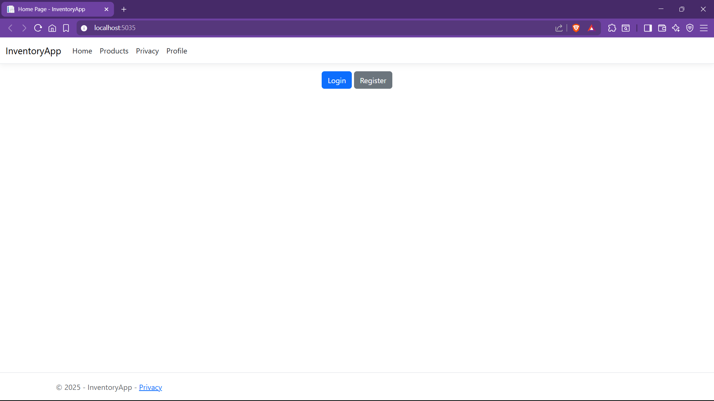 | 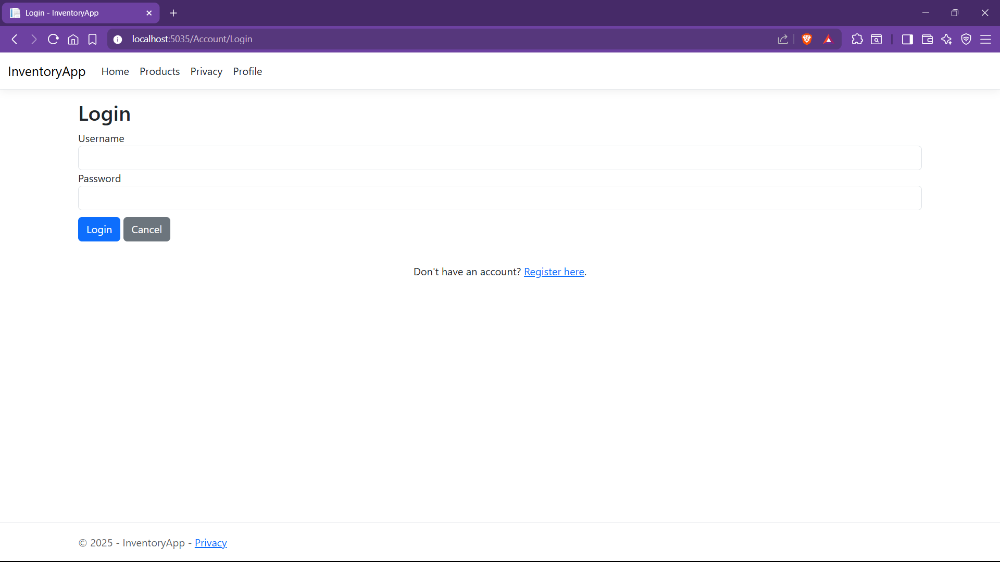 | 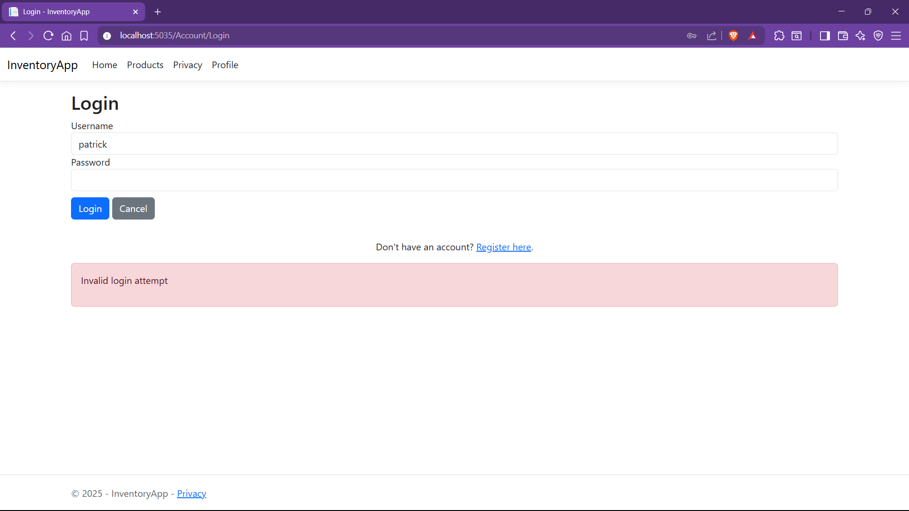 |

### Product Management
| Create Page | Edit Page | Admin Product List | User Product List |
|-------------|-----------|-------------------|-------------------|
| 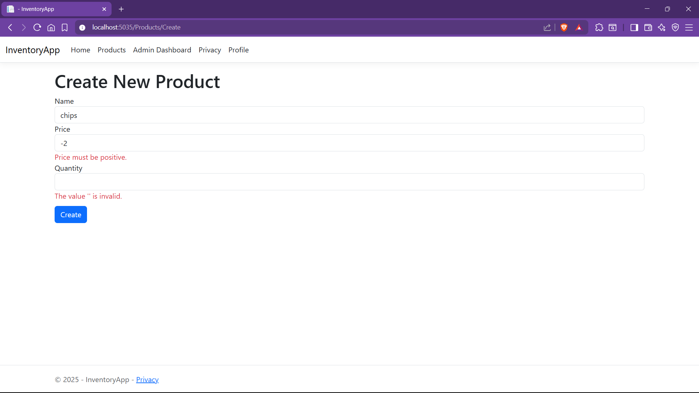 | 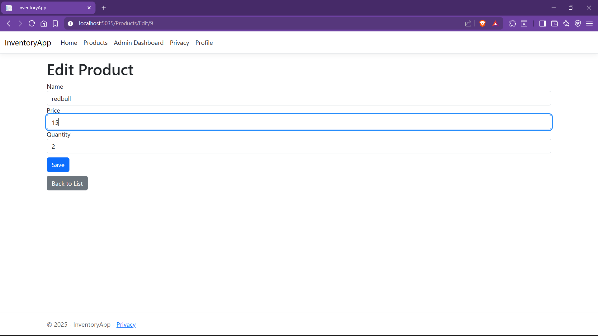 | 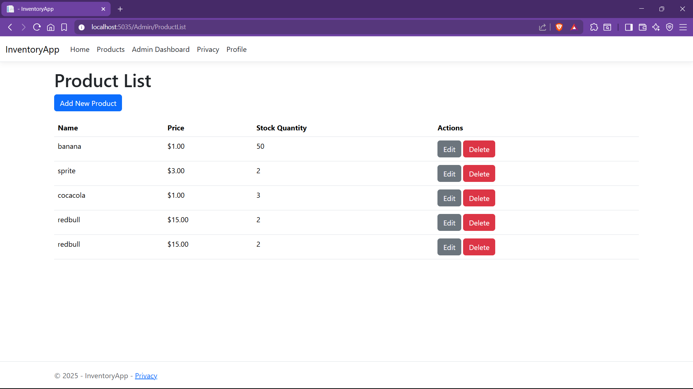 |  |

### Notification System
| Create Notification | Edit Notification | Delete Notification |
|---------------------|-------------------|---------------------|
| 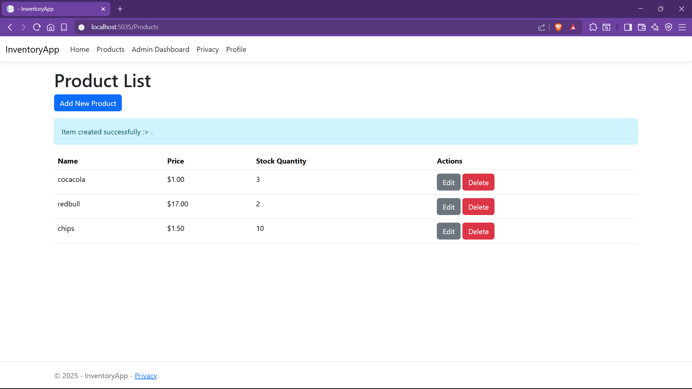 | 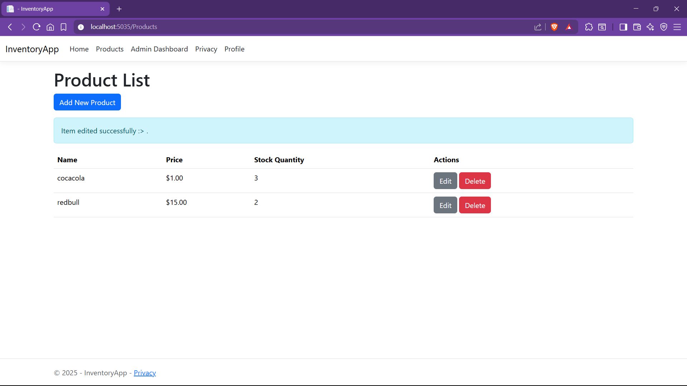 | 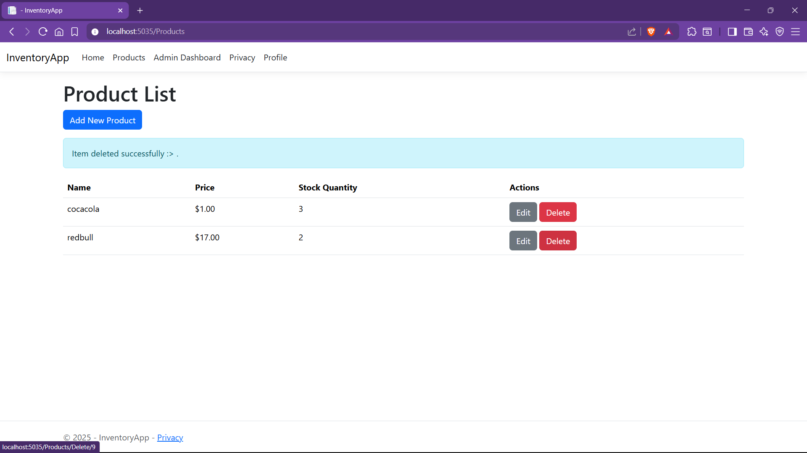 |

### Admin Dashboard
| Admin Dashboard | Admin Home | Admin User List |
|----------------|------------|-----------------|
| 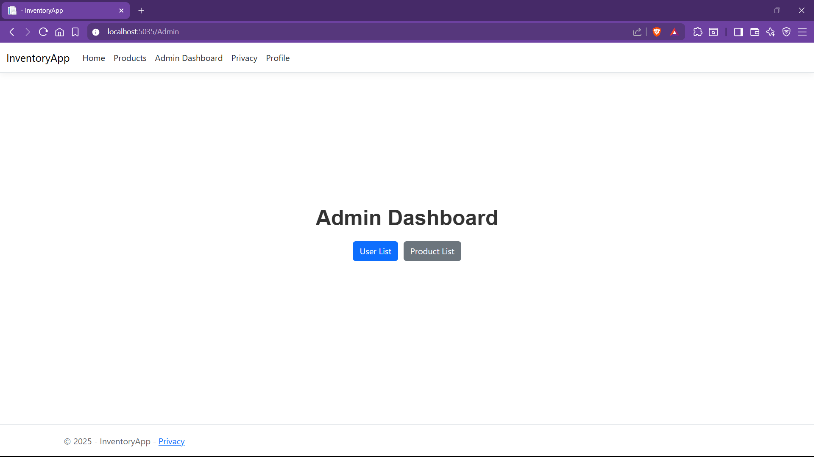 | 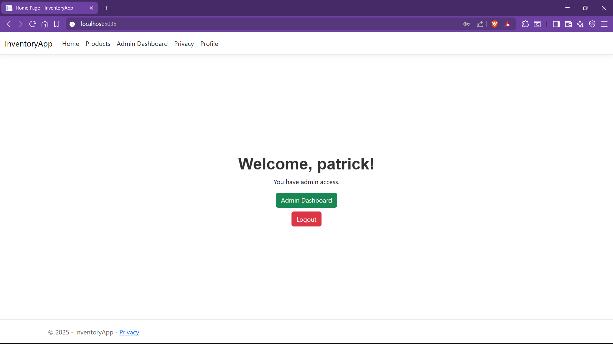 | 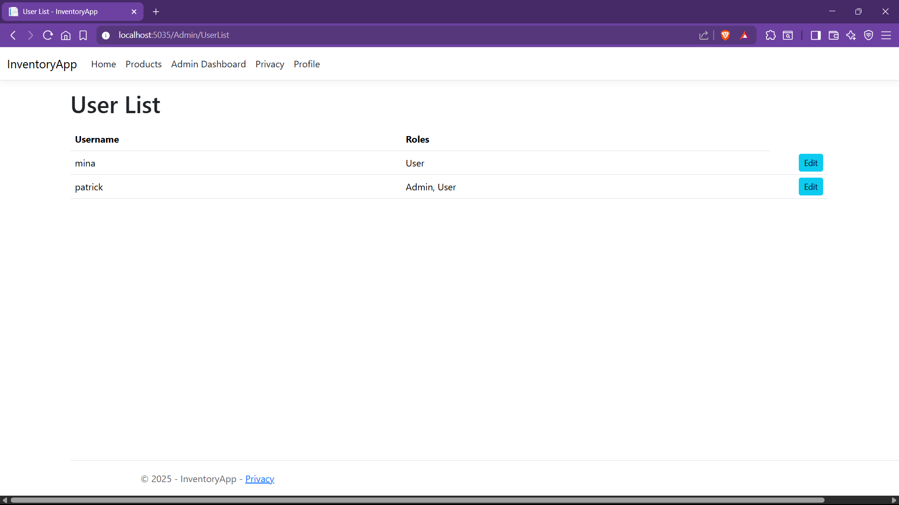 |


## ⚙️ Getting Started

1. Clone the repo:
   ```bash
   git clone https://github.com/patrick856/Inventory-system.git
   cd Inventory-system

